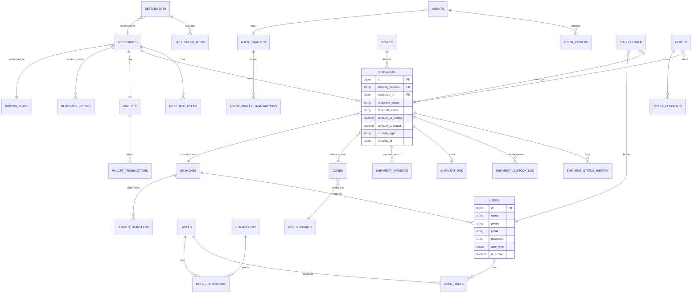

# 3. تصميم قاعدة البيانات (Database Design & ERD)

قاعدة البيانات: **MySQL 8.0** (InnoDB Engine لدعم المفاتيح الأجنبية والمعاملات Transactions — ضروري للجزء المالي).
الترميز: `utf8mb4_unicode_ci` (دعم كامل للعربية والإيموجي في الملاحظات).

## 3.1 مخطط العلاقات الكيانية (ERD) — عرض مبسّط

> هذا مخطط مبسّط للعلاقات الرئيسية فقط. القائمة الكاملة للجداول (٤٥+ جدول) موضحة في القسم التالي بالتفصيل.

## 3.2 قاموس الجداول التفصيلي (Data Dictionary)

### 3.2.1 مجموعة المستخدمين والصلاحيات

**`users`**
| الحقل | النوع | ملاحظات |
|---|---|---|
| id | BIGINT UNSIGNED PK | |
| name | VARCHAR(150) | |
| phone | VARCHAR(20) UNIQUE | معرّف تسجيل دخول رئيسي (شائع في مصر) |
| email | VARCHAR(150) NULLABLE UNIQUE | |
| password | VARCHAR(255) | Bcrypt |
| user_type | ENUM | super_admin, company_owner, ops_manager, branch_manager, customer_service, accountant, merchant, merchant_employee, agent, agent_driver, driver, warehouse_employee |
| branch_id | BIGINT FK NULLABLE | للموظفين المرتبطين بفرع |
| merchant_id | BIGINT FK NULLABLE | لمستخدمي التاجر |
| agent_id | BIGINT FK NULLABLE | لموظفي/مندوبي الوكيل |
| is_active | BOOLEAN DEFAULT true | |
| two_factor_enabled | BOOLEAN DEFAULT false | |
| last_login_at | TIMESTAMP NULLABLE | |
| created_at / updated_at / deleted_at | TIMESTAMP | Soft Delete مفعّل |

**`roles`**: id, name, slug (unique), is_system_role (boolean — الأدوار الافتراضية غير القابلة للحذف), created_at
**`permissions`**: id, name, slug (unique), module (لتجميع الصلاحيات في الواجهة: shipments, wallet, settlements...), created_at
**`role_permissions`**: role_id FK, permission_id FK (مركّب PK)
**`user_roles`**: user_id FK, role_id FK (مركّب PK) — يدعم أكثر من دور للمستخدم الواحد
**`user_permission_overrides`**: user_id FK, permission_id FK, is_granted (boolean) — استثناءات فردية فوق الدور

### 3.2.2 الجغرافيا (لدعم التقسيم الإداري المصري)

**`governorates`**: id, name_ar, name_en, code
**`zones`** (مركز/منطقة داخل المحافظة): id, governorate_id FK, name_ar, name_en, delivery_days_estimate (INT)
**`areas`** (حي/قرية — المستوى الأدق): id, zone_id FK, name_ar

### 3.2.3 الفروع

**`branches`**: id, name, code (unique), governorate_id FK, address, phone, manager_id FK (users), is_active, created_at
**`branch_transfers`**: id, transfer_number (unique), from_branch_id FK, to_branch_id FK, status (pending/in_transit/received), sent_by FK(users), received_by FK(users) nullable, sent_at, received_at, notes
**`branch_transfer_items`**: id, branch_transfer_id FK, shipment_id FK — الشحنات ضمن دفعة النقل

### 3.2.4 التجار

**`merchants`**: id, business_name, owner_name, phone, email, national_id, governorate_id FK, pricing_plan_id FK, status (pending/active/suspended), pod_photo_required (enum: required/optional/disabled), pod_signature_required (enum), free_returns (boolean), return_discount_percent (decimal), api_token (unique, hashed), created_at
**`merchant_users`**: id, merchant_id FK, user_id FK, role_in_merchant (owner/employee), permissions_scope (JSON — مثال: {"can_view_wallet": false})

### 3.2.5 الوكلاء

**`agents`**: id, name, governorate_id FK, phone, commission_type (fixed/percentage), commission_value (decimal), status, created_at
**`agent_drivers`**: id, agent_id FK, user_id FK (user_type=agent_driver)

### 3.2.6 المندوبين والمركبات

**`vehicles`**: id, plate_number, type (motorcycle/car/van), assigned_driver_id FK nullable, branch_id FK nullable
(بيانات المندوب نفسه تُخزَّن في `users` مع user_type=driver + حقول إضافية: `driver_profile` جدول فرعي به `national_id`, `license_number`, `cash_limit`, `current_branch_id`)

### 3.2.7 الشحنات (الجدول المحوري)

**`shipments`**
| الحقل | النوع | ملاحظات |
|---|---|---|
| id | BIGINT PK | |
| tracking_number | VARCHAR(30) UNIQUE INDEX | يُستخدم في Barcode/QR والتتبع العام |
| merchant_id | BIGINT FK INDEX | |
| reference_number | VARCHAR(100) NULLABLE | رقم أوردر التاجر الخاص (للربط مع المتجر الإلكتروني) |
| consignee_name | VARCHAR(150) | اسم المستلم |
| consignee_phone | VARCHAR(20) INDEX | |
| consignee_phone_alt | VARCHAR(20) NULLABLE | |
| governorate_id | BIGINT FK | |
| zone_id | BIGINT FK | |
| area_id | BIGINT FK NULLABLE | |
| address_text | TEXT | |
| gps_lat / gps_lng | DECIMAL NULLABLE | يُلتقط عند التسليم أو يُدخله العميل عبر رابط التتبع |
| package_description | VARCHAR(255) NULLABLE | |
| weight_kg | DECIMAL(6,2) NULLABLE | |
| service_type | ENUM | normal, express, same_day |
| payment_method | ENUM | cod, prepaid, visa_on_delivery, bank_transfer, wallet_payment |
| collection_required | BOOLEAN | |
| amount_to_collect | DECIMAL(10,2) | |
| amount_collected | DECIMAL(10,2) DEFAULT 0 | |
| shipping_fee | DECIMAL(10,2) | تكلفة الشحن المحسوبة من محرك التسعير |
| shipment_status | VARCHAR(40) INDEX | القيم الكاملة في [05-Workflows.md](./05-Workflows.md) |
| financial_status | ENUM INDEX | uncollected, collected, received_by_branch, received_by_company, settled_to_merchant |
| custody_type | ENUM | branch, driver, agent, vehicle, warehouse |
| custody_id | BIGINT NULLABLE | معرّف الجهة الحائزة حاليًا (Polymorphic مع custody_type) |
| current_branch_id | BIGINT FK NULLABLE | آخر فرع مرّت به الشحنة (للاستعلام السريع "أين الشحنة؟") |
| assigned_driver_id | BIGINT FK NULLABLE | |
| assigned_agent_id | BIGINT FK NULLABLE | |
| delivery_attempts_count | TINYINT DEFAULT 0 | |
| scheduled_delivery_date | DATE NULLABLE | |
| delivered_at | TIMESTAMP NULLABLE | |
| returned_at | TIMESTAMP NULLABLE | |
| is_return_trip | BOOLEAN DEFAULT false | شحنة مرتجع (رحلة عكسية من العميل للتاجر) |
| barcode_value / qr_value | VARCHAR(64) | |
| created_by | BIGINT FK | |
| created_at / updated_at | TIMESTAMP | |

**`shipment_status_history`**: id, shipment_id FK INDEX, status, changed_by FK(users), reason TEXT NULLABLE, gps_lat, gps_lng, created_at
**`shipment_custody_log`**: id, shipment_id FK INDEX, from_type, from_id, to_type, to_id, handed_by FK(users), received_by FK(users) NULLABLE, handed_at, received_at NULLABLE, status (pending/confirmed)
**`shipment_pod`**: id, shipment_id FK UNIQUE, photo_path NULLABLE, signature_path NULLABLE, notes TEXT NULLABLE, gps_lat, gps_lng, recorded_at, recorded_by FK(users)
**`delivery_attempts`**: id, shipment_id FK INDEX, attempt_number, result (no_answer/postponed/wrong_address/refused_price/refused_receipt), notes, driver_id FK, attempted_at

### 3.2.8 المالية — العهدة النقدية والمحفظة

**`cash_ledger`** (سجل العهدة النقدية الموحّد لكل الأطراف — مندوب/فرع/وكيل)
| الحقل | النوع |
|---|---|
| id | BIGINT PK |
| holder_type | ENUM (driver, branch, agent) |
| holder_id | BIGINT |
| entry_type | ENUM (collection, handover_out, handover_in, adjustment) |
| amount | DECIMAL(10,2) |
| shipment_id | BIGINT FK NULLABLE |
| related_handover_id | BIGINT FK NULLABLE — يربط عملية تسليم/استلام النقدية |
| balance_after | DECIMAL(10,2) | رصيد محسوب بعد هذه الحركة (Snapshot للأداء) |
| created_by | BIGINT FK |
| created_at | TIMESTAMP |

**`cash_handovers`**: id, handover_number UNIQUE, from_type, from_id, to_type, to_id, amount, status (pending/confirmed), handed_by, received_by NULLABLE, handed_at, confirmed_at NULLABLE, receipt_attachment_path NULLABLE

**`wallets`**: id, merchant_id FK UNIQUE, current_balance DECIMAL(12,2) (Cache محسوب من الـ Ledger)
**`wallet_transactions`**: id, wallet_id FK INDEX, type (credit_collection, debit_shipping_fee, debit_return_fee, settlement_payout, manual_adjustment), amount, shipment_id FK NULLABLE, settlement_id FK NULLABLE, balance_after, description, created_by, created_at

**`agent_wallets`**: id, agent_id FK UNIQUE, current_balance DECIMAL(12,2)
**`agent_wallet_transactions`**: نفس بنية wallet_transactions مع type إضافي (commission_earned)

### 3.2.9 التسعير

**`pricing_plans`**: id, name (Silver/Gold/Platinum...), description, is_active
**`pricing_rules`**: id, pricing_plan_id FK NULLABLE (NULL = قاعدة عامة افتراضية), governorate_id FK NULLABLE, zone_id FK NULLABLE, weight_from, weight_to, service_type, price DECIMAL(8,2), return_price DECIMAL(8,2)
**`merchant_pricing`**: id, merchant_id FK INDEX, governorate_id FK NULLABLE, zone_id FK NULLABLE, weight_from, weight_to, service_type, price, return_price — أولوية أعلى من `pricing_rules` عند الحساب

### 3.2.10 التسويات

**`settlements`**: id, settlement_number UNIQUE, merchant_id FK INDEX, total_amount DECIMAL(12,2), status (draft/pending_approval/approved/paid), period_from, period_to, created_by, approved_by NULLABLE, approved_at NULLABLE, paid_at NULLABLE
**`settlement_items`**: id, settlement_id FK INDEX, shipment_id FK, amount_included
**`settlement_attachments`**: id, settlement_id FK, file_path, file_type (transfer_proof/pdf/receipt), uploaded_by

**`agent_settlements`** / **`agent_settlement_items`**: نفس البنية للوكلاء

### 3.2.11 الشكاوى

**`tickets`**: id, ticket_number UNIQUE, shipment_id FK NULLABLE, type (lost_shipment/delay/collection_error/driver_complaint/agent_complaint/other), status (open/in_progress/escalated/resolved/closed), priority, created_by, assigned_to FK(users) NULLABLE, sla_due_at, resolved_at NULLABLE
**`ticket_comments`**: id, ticket_id FK, user_id FK, comment TEXT, attachment_path NULLABLE, created_at

### 3.2.12 الإشعارات والسجلات

**`notifications`**: id (UUID), notifiable_type, notifiable_id, channel (whatsapp/sms/email/push/in_app), event_key, payload JSON, status (pending/sent/failed), sent_at
**`notification_templates`**: id, event_key UNIQUE, channel, template_body, is_active
**`activity_log`**: id, actor_id FK, actor_type, action (created/updated/deleted/status_changed), subject_type, subject_id, description, created_at — للـ Feed اللحظي
**`audit_log`**: id, user_id FK, action, model_type, model_id, old_values JSON, new_values JSON, ip_address, user_agent, gps_lat NULLABLE, gps_lng NULLABLE, created_at — INDEX على (model_type, model_id) و (user_id, created_at)

### 3.2.13 التكاملات

**`integrations`**: id, merchant_id FK, platform (woocommerce/shopify/opencart/magento), store_url, api_key_encrypted, api_secret_encrypted, webhook_secret, is_active
**`api_keys`**: id, merchant_id FK NULLABLE, agent_id FK NULLABLE, key_hash, name, last_used_at, is_active, scopes JSON

## 3.3 الفهارس الحرجة (Critical Indexes)

| الجدول | الفهرس | السبب |
|---|---|---|
| shipments | `tracking_number` (unique) | بحث/تتبع فوري |
| shipments | `(merchant_id, shipment_status)` | Dashboard التاجر |
| shipments | `(custody_type, custody_id)` | استعلام "عهدتي الحالية" لكل مندوب/فرع/وكيل |
| shipments | `(financial_status, shipment_status)` | لوحة المطابقة المالية |
| shipment_status_history | `(shipment_id, created_at)` | بناء Timeline الشحنة بترتيب زمني سريع |
| cash_ledger | `(holder_type, holder_id, created_at)` | حساب الرصيد اللحظي بسرعة |
| wallet_transactions | `(wallet_id, created_at)` | كشف حساب التاجر |
| audit_log | `(model_type, model_id)`, `(user_id, created_at)` | البحث والتصفية في التدقيق |

## 3.4 سياسات الأرشفة (Archiving Policy)

- **Soft Delete** مفعّل على: `shipments`, `users`, `merchants`, `agents` (لا حذف فعلي أبدًا لبيانات مالية أو تشغيلية).
- **الأرشفة الباردة (Cold Archiving)**: الشحنات المُغلقة (Delivered/Returned نهائيًا) منذ أكثر من 18 شهرًا تُنقل دوريًا (Job مجدول شهريًا) إلى جداول أرشيف مطابقة البنية (`shipments_archive`, `shipment_status_history_archive`) لتخفيف حجم الجداول التشغيلية النشطة وتحسين الأداء، مع بقائها قابلة للاستعلام عبر واجهة "بحث الأرشيف".
- **audit_log و activity_log**: تُحتفظ بها 24 شهرًا كحد أدنى على الجدول الحي، ثم تُصدَّر لملفات CSV مضغوطة تُخزَّن خارج قاعدة البيانات (تلبية لمتطلبات النزاعات المحتملة) وتُحذف من الجدول الحي بعد التصدير.
- **الملفات (صور POD، مرفقات التسويات)**: تبقى مرتبطة بسجلاتها بدون حذف تلقائي؛ يُنصح بترحيلها إلى تخزين رخيص (S3-compatible) بعد 12 شهرًا إذا زاد حجم `storage/` عن الحصة المتاحة على cPanel.

## 3.5 سياسات النسخ الاحتياطي (Backup Policy)

| النوع | التكرار | الاحتفاظ | الأداة على cPanel |
|---|---|---|---|
| نسخة كاملة لقاعدة البيانات (mysqldump) | يوميًا (Cron، خارج ساعات الذروة) | 30 يومًا محليًا | Cron Job + `mysqldump` مضغوط، أو JetBackup/Softaculous Backup إن متوفر في الاستضافة |
| نسخة تصاعدية لملفات `storage/` | يوميًا | 14 يومًا | `rsync`/ضغط دوري عبر Cron |
| نسخة كاملة خارج الخادم (Off-site) | أسبوعيًا | 90 يومًا | رفع تلقائي لتخزين سحابي خارجي (S3/Google Drive عبر API) — **إلزامي**، لا يُكتفى بنسخ cPanel المحلية فقط تجنبًا لفقدان البيانات عند مشكلة بالخادم نفسه |
| اختبار استعادة (Restore Drill) | شهريًا | — | تنفيذ استعادة تجريبية على بيئة Staging للتأكد من صلاحية النسخ فعليًا |

## 3.6 معاملات قاعدة البيانات الحرجة (Transactional Integrity)

كل عملية تمس أكثر من جدول مالي مترابط (مثال: تسليم شحنة COD → تحديث `shipments` + إدراج `cash_ledger` + إدراج `shipment_status_history`) **يجب** أن تُنفَّذ داخل DB Transaction واحدة (`DB::transaction()`) لضمان عدم حدوث حالة متضاربة (مثال: تسجيل التحصيل بدون تحديث حالة الشحنة أو العكس) عند أي فشل جزئي.
