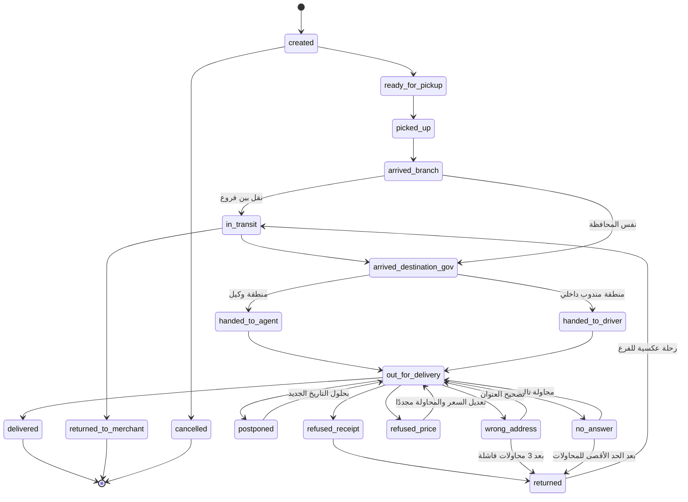
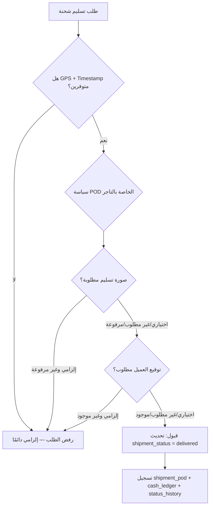
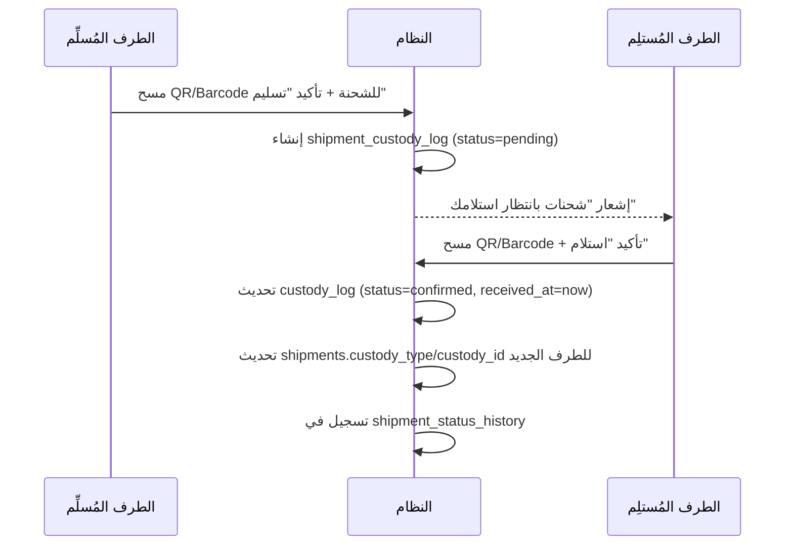
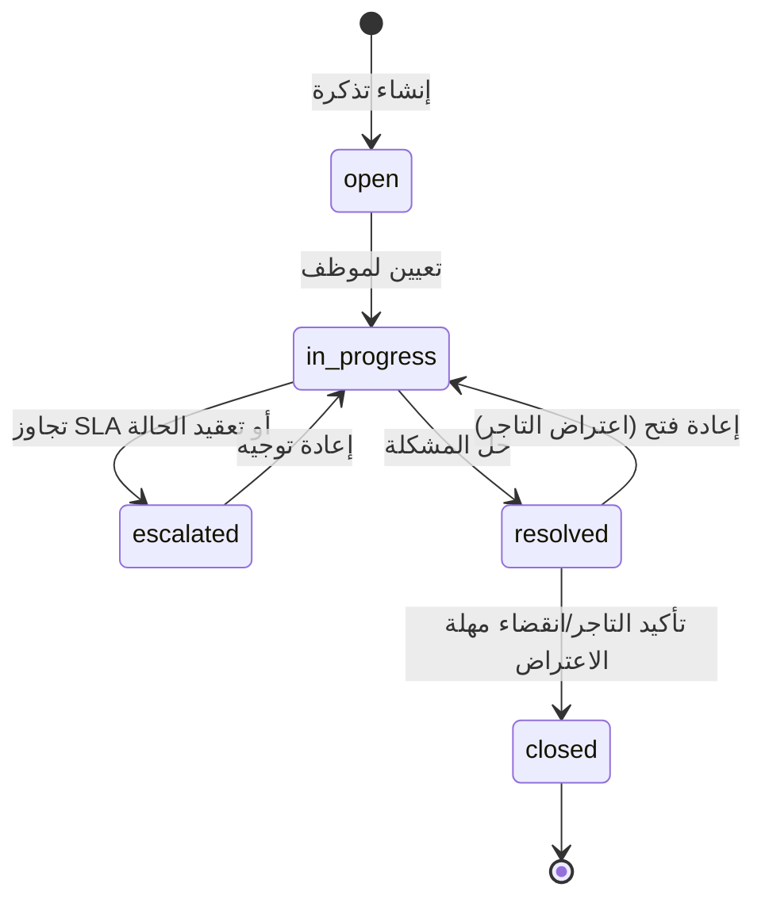
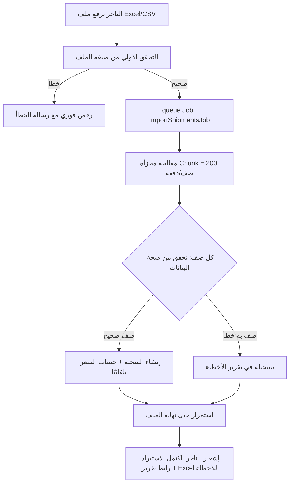

# 5. سير العمل (Workflows)

## 5.1 دورة حياة الشحنة الكاملة (Shipment Lifecycle)

### 5.1.1 قائمة الحالات التشغيلية (Shipment Status) الكاملة

| الكود (DB value) | الاسم بالعربي | الوصف |
|---|---|---|
| `created` | تم إنشاء الشحنة | التاجر أنشأ الشحنة (يدويًا/Excel/API) — لم تُستلم بعد |
| `ready_for_pickup` | جاهزة للاستلام | التاجر جهّز الطرد وطلب استلامه |
| `picked_up` | تم الاستلام من التاجر | مندوب/فرع استلم الطرد فعليًا |
| `arrived_branch` | وصلت الفرع | دخلت مخزون فرع الاستلام |
| `in_transit` | قيد النقل | في طريقها بين الفروع (Branch Transfer) |
| `arrived_destination_gov` | وصلت محافظة الوجهة | وصلت الفرع/المخزن في محافظة العميل |
| `handed_to_agent` | تم تسليمها للوكيل | نُقلت لعهدة وكيل خارجي |
| `handed_to_driver` | تم تسليمها للمندوب | نُقلت لعهدة مندوب توصيل داخلي |
| `out_for_delivery` | خرجت للتسليم | المندوب بدأ جولة التسليم |
| `delivered` | تم التسليم | نجحت — حالة نهائية |
| `no_answer` | لا يرد | محاولة فاشلة — تُعاد الجدولة |
| `postponed` | مؤجل | العميل طلب التأجيل لتاريخ لاحق |
| `refused_receipt` | رفض الاستلام | العميل رفض استلام الطرد أصلًا |
| `refused_price` | رفض السعر | العميل رفض دفع المبلغ المطلوب |
| `wrong_address` | عنوان خاطئ | تعذر الوصول للعنوان |
| `returned` | مرتجع | تقرر إرجاعها للتاجر (بعد محاولات/رفض) |
| `returned_to_merchant` | تم إرجاعها للتاجر | أُغلقت دورة الإرجاع فعليًا — حالة نهائية |
| `cancelled` | ملغاة | إلغاء قبل الاستلام من التاجر |

> **الحالات النهائية (Terminal States)**: `delivered`, `returned_to_merchant`, `cancelled`. أي حالة أخرى تسمح بالانتقال لحالات لاحقة.
> **قابلية التخصيص**: جدول `workflow_transitions` يحدد الانتقالات المسموحة رسميًا (from_status → to_status → required_role) بحيث يمكن للإدارة تعديل تسلسل الحالات دون تعديل الكود (مثال: شركة قد تريد حالة إضافية "بانتظار موافقة العميل على السعر الجديد").

### 5.1.2 مخطط الحالة (State Diagram)

### 5.1.3 قواعد العمل المرتبطة بالحالات

- الحد الأقصى الافتراضي لمحاولات التسليم قبل الترحيل التلقائي لحالة "مرتجع" = **3 محاولات** (قابل للتعديل لكل تاجر عبر `merchants.max_delivery_attempts`).
- الانتقال إلى `delivered` **محكوم بفحص POD** (القسم 5.1.4) — لا يمكن حفظ الحالة في قاعدة البيانات دون استيفاء الشروط الإلزامية.
- الانتقال إلى `delivered` أو أي حالة تحصيل ينشئ تلقائيًا (ضمن نفس Transaction):
  1. سجل في `shipment_status_history`.
  2. سجل في `cash_ledger` (إن كان `collection_required = true`) بقيمة `amount_collected` لصالح حامل العهدة الحالي (المندوب/الوكيل).
  3. تحديث `financial_status` إلى `uncollected` (تبقى كذلك حتى تُوَرَّد فعليًا — انظر 5.3).

### 5.1.4 محرك POD القابل للتخصيص (Policy Engine)

عند محاولة أي مستخدم (Driver/Agent) تغيير حالة شحنة إلى `delivered`:

## 5.2 دورة حياة العهدة (Custody Chain)

كل نقل عهدة (فرع↔فرع، فرع→مندوب، مندوب→وكيل...) يتبع نفس النمط ثنائي التأكيد:

- إذا لم يؤكد الطرف المُستلِم خلال مهلة محددة (إعداد نظام، افتراضيًا 24 ساعة)، يُنشأ تنبيه تلقائي لمدير العمليات (شحنة "عالقة" بين طرفين).
- تقرير "عهدتي الحالية" لأي مستخدم = `SELECT * FROM shipments WHERE custody_type = ? AND custody_id = ?` — استعلام مباشر ومفهرس (لا يحتاج تجميع من التاريخ).

## 5.3 دورة العهدة النقدية والتسوية المالية

```mermaid
flowchart LR
    subgraph مستوى_المندوب
        D1[تحصيل نقدي عند التسليم] --> D2[cash_ledger: entry_type=collection]
    end
    D2 --> H1[توريد نقدية للفرع نهاية اليوم]
    H1 --> H2[cash_handovers: pending]
    H2 --> H3{مدير الفرع يؤكد الاستلام}
    H3 -- تأكيد --> H4[financial_status → received_by_branch]
    H4 --> H5[توريد الفرع للخزينة المركزية]
    H5 --> H6{المحاسب يؤكد}
    H6 -- تأكيد --> H7[financial_status → received_by_company]
    H7 --> S1[تجميع الشحنات المؤهلة في تسوية]
    S1 --> S2[settlements: draft]
    S2 --> S3[اعتماد المحاسب/الأونر]
    S3 --> S4[settlements: approved]
    S4 --> S5[تحويل فعلي للتاجر + رفع إثبات]
    S5 --> S6[settlements: paid]
    S6 --> S7[financial_status → settled_to_merchant]
```

**قاعدة أساسية**: لا تدخل أي شحنة ضمن تسوية جديدة إلا إذا كانت `financial_status = received_by_company` (أو `financial_status = collected` عند الدفع المسبق حيث لا تحصيل ميداني أصلًا). هذا يمنع تسوية شحنات لا تزال نقديتها بحوزة مندوب أو وكيل.

## 5.4 دورة حياة التذكرة (Ticket/Complaint Workflow)

| نوع التذكرة | SLA افتراضي للاستجابة الأولى | SLA افتراضي للحل |
|---|---|---|
| شحنة مفقودة | 2 ساعة عمل | 48 ساعة |
| تأخير | 4 ساعات عمل | 24 ساعة |
| خطأ تحصيل | 2 ساعة عمل | 24 ساعة |
| شكوى مندوب/وكيل | 4 ساعات عمل | 72 ساعة (تتطلب تحقيق) |

## 5.5 مصفوفة الأحداث والإشعارات (Notification Matrix)

| الحدث | المستقبل | القناة الأساسية | القناة الاحتياطية |
|---|---|---|---|
| إنشاء شحنة | التاجر | In-App | — |
| الشحنة "خرجت للتسليم" | العميل النهائي | WhatsApp | SMS |
| فشل محاولة تسليم | التاجر + العميل | WhatsApp | SMS |
| تم التسليم | التاجر | WhatsApp + In-App | Email |
| تم الإرجاع للتاجر | التاجر | WhatsApp + In-App | — |
| توريد نقدية معلّق تأكيد | مدير الفرع/المحاسب | Push + In-App | SMS |
| تجاوز عهدة مندوب الحد الأقصى | مدير الفرع + مدير العمليات | Push + In-App | — |
| إنشاء تسوية جديدة | التاجر | WhatsApp + Email | In-App |
| اعتماد تسوية | التاجر | WhatsApp + Email (مع المرفق) | — |
| تذكرة شكوى جديدة | خدمة العملاء المعنية | In-App + Push | — |
| تجاوز SLA لتذكرة | مدير خدمة العملاء | Push + Email | — |

> تُدار هذه المصفوفة من شاشة إدارية (`notification_templates` + إعداد Event→Channel) دون الحاجة لتعديل الكود عند تغيير قناة أو نص أي إشعار.

## 5.6 دورة رفع الشحنات بالجملة (Bulk Import Workflow)

هذا التصميم إلزامي على cPanel Shared Hosting لتفادي `timeout` عند رفع آلاف الصفوف دفعة واحدة عبر HTTP request واحد.
