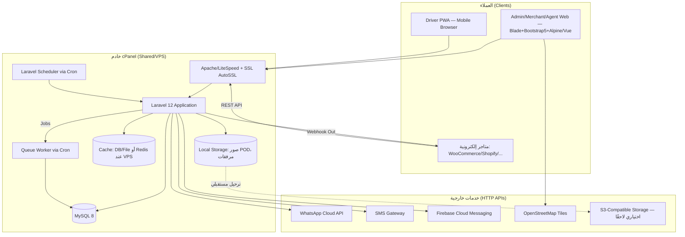

# 8. معمارية النظام، الأمان، النشر، التوسع، والمراقبة

## 8.1 معمارية النظام العامة



## 8.2 النشر على استضافة cPanel — خطوات عملية

### 8.2.1 المتطلبات الدنيا للاستضافة
- PHP 8.3 أو أحدث (يُفعَّل من "MultiPHP Manager" في cPanel).
- MySQL 8 (أو MariaDB 10.6+ المتوافقة).
- مساحة تخزين تبدأ من 5GB (تنمو مع صور POD والمرفقات — يُنصح بخطة قابلة للترقية).
- إمكانية الوصول عبر SSH (أساسي لتشغيل Composer وArtisan بكفاءة؛ متوفر في أغلب باقات cPanel المدفوعة).
- إمكانية إنشاء Cron Jobs (متوفرة قياسيًا في كل cPanel).
- شهادة SSL مجانية عبر AutoSSL (Let's Encrypt) — تُفعَّل تلقائيًا لكل نطاق فرعي.

### 8.2.2 خطوات النشر الأولي
1. إنشاء قاعدة بيانات MySQL ومستخدم مخصص عبر "MySQL Databases" في cPanel، ومنحه كل الصلاحيات على القاعدة فقط (لا صلاحيات عامة على السيرفر).
2. رفع الكود عبر Git (`cPanel Git Version Control`) أو عبر SSH + `git clone` مباشرة إلى مجلد خارج `public_html` (مثال: `/home/user/app/`)، مع توجيه Document Root إلى `app/public` فقط (حماية بقية ملفات Laravel من الوصول المباشر عبر الويب).
3. `composer install --optimize-autoloader --no-dev` عبر SSH.
4. نسخ `.env.example` إلى `.env` وضبط: `APP_ENV=production`, `APP_DEBUG=false`, بيانات قاعدة البيانات، `CACHE_STORE=database`, `QUEUE_CONNECTION=database`, `SESSION_DRIVER=database`.
5. `php artisan key:generate`
6. `php artisan migrate --force` ثم `php artisan db:seed --class=ProductionSeeder` (أدوار وصلاحيات أساسية + بيانات المحافظات/المناطق).
7. `php artisan storage:link`
8. بناء أصول الواجهة الأمامية محليًا (`npm run build`) ورفع مجلد `public/build` فقط — **لا حاجة لتثبيت Node.js على السيرفر**.
9. ضبط الصلاحيات: `storage/` و `bootstrap/cache/` بصلاحية كتابة لمستخدم الويب فقط (755/775 حسب إعداد الاستضافة).
10. إعداد Cron Jobs (القسم التالي).
11. `php artisan config:cache && php artisan route:cache && php artisan view:cache` لتحسين الأداء على استضافة بموارد محدودة.

### 8.2.3 إعداد Cron Jobs (بديل Supervisor على Shared Hosting)

في cPanel > Cron Jobs، تُضاف الأسطر التالية:

```
* * * * * cd /home/user/app && php artisan schedule:run >> /dev/null 2>&1
* * * * * cd /home/user/app && timeout 55 php artisan queue:work --stop-when-empty --tries=3 --max-time=50 >> /dev/null 2>&1
```

- السطر الأول: مُشغّل الجدولة القياسي في Laravel (يُدير النسخ الاحتياطي الدوري، إرسال التقارير المجدولة، فحص SLA... كل ما هو مجدول عبر `app/Console/Kernel.php`).
- السطر الثاني: **بديل عملي لـ Supervisor** — ينفّذ عامل طابور واحد كل دقيقة يعالج المهام المتراكمة (إرسال إشعارات، معالجة استيراد Excel، إرسال Webhooks) ثم يتوقف تلقائيًا؛ الـ `timeout 55` يمنع تراكم عمليات متوازية عند تأخر التنفيذ.
- **عند الترقية لاحقًا إلى VPS بصلاحيات root**: يُستبدل هذا الأسلوب بـ `Supervisor` حقيقي يُشغّل `queue:work` بشكل دائم (Daemon) مع Redis كـ Queue Driver، لأداء أعلى ودعم Horizon للمراقبة اللحظية للطوابير — دون أي تعديل في كود التطبيق نفسه (فقط تغيير `.env`).

### 8.2.4 بيئات التشغيل (Environments)

| البيئة | الغرض |
|---|---|
| Local | تطوير على أجهزة المطورين (Laravel Sail/Valet) |
| Staging | نسخة مطابقة للإنتاج على subdomain منفصل لاختبار كل إصدار قبل النشر الفعلي |
| Production | النطاق الرئيسي على cPanel |

النشر من Staging إلى Production عبر Git (فرع `main` محمي، يتطلب Pull Request + مراجعة قبل الدمج).

## 8.3 معمارية الأمان (Security Architecture)

| الطبقة | الإجراء |
|---|---|
| النقل | HTTPS إجباري (HSTS مفعّل)، إعادة توجيه تلقائي من HTTP |
| المصادقة | Bcrypt/Argon2 لكلمات المرور، 2FA عبر OTP للأدوار الحساسة، قفل الحساب بعد 5 محاولات فاشلة مع Cooldown تصاعدي |
| التفويض | Policies/Gates على مستوى كل Model في Laravel + Global Scopes للعزل حسب الفرع/التاجر/الوكيل |
| حماية الويب | CSRF Tokens (مدمج Laravel)، XSS (Blade escaping تلقائي + CSP Headers)، SQL Injection (Eloquent ORM/Prepared Statements حصريًا — منع أي Raw Query غير مُعقّم) |
| حماية API | Sanctum Tokens قابلة للإلغاء، Rate Limiting لكل مفتاح API، HMAC Signature على Webhooks الصادرة |
| حماية البيانات الحساسة | تشفير `api_key_secret`, بيانات بوابات الدفع، أرقام حسابات بنكية عبر Laravel `Crypt` (AES-256) قبل التخزين |
| سجل التدقيق | Audit Log غير قابل للتعديل من واجهة المستخدم (Append-only)، مع صلاحية عرض محصورة |
| النسخ الاحتياطي والاستعادة | مفصّل في [03-Database-Design-ERD.md](./03-Database-Design-ERD.md#35-سياسات-النسخ-الاحتياطي-backup-policy) |
| فحص الثغرات | فحص دوري بأدوات مثل `composer audit` / `npm audit` + مراجعة أمنية يدوية قبل كل إصدار كبير |
| حماية من الهجمات الآلية | Google reCAPTCHA/hCaptcha على نماذج تسجيل الدخول والتسجيل العامة، Rate Limiting على مستوى IP |
| إدارة الجلسات | انتهاء صلاحية الجلسة بعد فترة خمول (قابل للتخصيص لكل دور — أقصر للأدوار المالية) |
| الخصوصية | الالتزام بقانون حماية البيانات الشخصية المصري: تقليل جمع البيانات لما هو ضروري فقط، حق طلب حذف بيانات العميل النهائي بعد فترة الاحتفاظ القانونية |

## 8.4 خطة قابلية التوسع (Scalability Plan)

### المرحلة 1 — MVP على cPanel مشترك/VPS بسيط
- Cache/Queue عبر Database Driver، خادم واحد يجمع كل الأدوار (Web + DB + Cron).
- يخدم بكفاءة حتى ~2,000-3,000 شحنة/يوم تقريبًا حسب موارد الباقة.

### المرحلة 2 — نمو متوسط (VPS مخصص)
- فصل قاعدة البيانات على خادم منفصل (Managed MySQL أو VPS مخصص لقاعدة البيانات).
- تفعيل Redis للـ Cache والـ Sessions والـ Queue.
- تفعيل Supervisor لعدة Queue Workers متوازية (منفصلة حسب نوع المهمة: إشعارات، استيراد، تقارير).
- تفعيل Laravel Horizon لمراقبة الطوابير لحظيًا.

### المرحلة 3 — نمو كبير (Enterprise Scale)
- فصل الخدمات (Service-Oriented): خدمة إشعارات مستقلة، خدمة تقارير/تحليلات مستقلة (Read Replica لقاعدة البيانات لتفريغ حمل التقارير الثقيلة عن قاعدة البيانات التشغيلية).
- Load Balancer أمام أكثر من خادم Web (Horizontal Scaling) خلف تخزين جلسات/كاش مركزي (Redis Cluster).
- CDN للأصول الثابتة والصور (تسريع الوصول من مختلف المحافظات).
- الانتقال المحتمل لـ Queue متقدم (مثل AWS SQS) عند الحاجة لموثوقية أعلى من طابور قاعدة البيانات.
- تفعيل Read/Write Splitting على مستوى Eloquent لفصل حمل القراءة (تقارير/Dashboard) عن الكتابة (عمليات تشغيلية حرجة).

> **مبدأ التصميم الأساسي**: كل هذا التطور **لا يتطلب إعادة كتابة كود التطبيق** — فقط تبديل قيم `.env` (Cache/Queue/DB Drivers) وإضافة بنية تحتية، لأن الكود يُبنى منذ اليوم الأول على تجريدات Laravel القياسية (Cache Facade, Queue Facade) دون ربط مباشر بتقنية بعينها.

## 8.5 استراتيجية المراقبة والـ Logging

| الأداة/الطبقة | الغرض | ملاحظة التوافق مع cPanel |
|---|---|---|
| Laravel Log (`storage/logs`) | أخطاء التطبيق العامة | متوفر دائمًا، بلا تكلفة إضافية |
| قناة Log مخصصة للعمليات المالية (`financial` channel) | تتبع منفصل لكل عملية مالية حساسة | ملف منفصل لسهولة المراجعة والامتثال |
| خدمة مراقبة أخطاء خارجية (Sentry/Bugsnag — النسخة المجانية كافية للبداية) | تنبيه فوري عند حدوث Exception في الإنتاج | HTTP API خارجي، لا يستهلك موارد سيرفر cPanel |
| Uptime Monitor خارجي (UptimeRobot أو مماثل) | التأكد من توفر الموقع وتنبيه فوري عند التعطل | مجاني للنطاق الأساسي |
| Laravel Telescope | تصحيح الأخطاء في بيئة Staging فقط (يُعطَّل في Production لتفادي استهلاك موارد) | |
| تقرير أداء دوري (Queue Health Check) | التأكد من عدم تراكم مهام في الطابور (Cron يفحص عدد المهام المعلّقة، وينبّه إن تجاوزت حدًا معينًا — مؤشر أن دورة الـ Cron كل دقيقة لم تعد كافية) | Job مجدول أسبوعيًا/يوميًا |
| مراجعة استهلاك المساحة/الموارد | تنبيه عند اقتراب الحصة المخصصة على cPanel من الامتلاء (خاصة `storage/` مع تراكم صور POD) | فحص دوري + سياسة الأرشفة (القسم 3.4) |

### تسلسل تصعيد الأعطال المقترح (Escalation)
1. Uptime Monitor يكتشف تعطلًا → إشعار فوري (SMS/Email) لمدير العمليات التقنية.
2. مراجعة Sentry/Logs لتحديد السبب.
3. في حال تعطل قاعدة البيانات/الخادم بالكامل: تفعيل خطة الاستعادة من آخر نسخة احتياطية (RTO مستهدف: أقل من 4 ساعات في بيئة cPanel).
