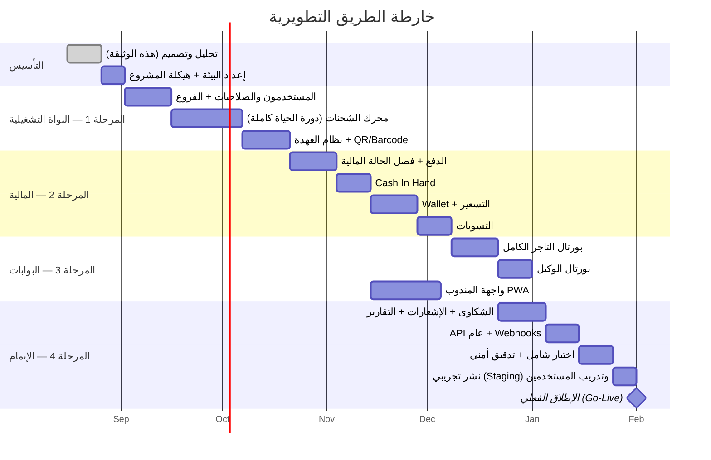

# 9. خارطة الطريق، نطاق MVP، هيكل الفريق، الجدول الزمني، والتكلفة التقديرية

## نطاق MVP

الهدف من MVP: نظام **قابل للتشغيل الفعلي على cPanel خلال أقل مدة ممكنة**، يغطي الدورة التشغيلية والمالية الأساسية لشركة شحن حقيقية، بدون أي ميزة "لطيفة لكن غير حرجة".

### ✅ داخل MVP

| الوحدة | التفاصيل المشمولة |
|---|---|
| المستخدمون والصلاحيات | الأدوار الأساسية (Super Admin, Ops Manager, Branch Manager, Accountant, Merchant, Driver) + صلاحيات قياسية جاهزة (بدون محرر أدوار مخصص متقدم في البداية) |
| الفروع | إنشاء فروع، نقل شحنات بين الفروع، مخزون لحظي |
| التجار | تسجيل تاجر، Dashboard أساسية، إنشاء شحنة يدوي + رفع Excel |
| الشحنات | دورة الحياة الكاملة بكل الحالات المذكورة، Barcode + QR |
| العهدة | نظام العهدة الكامل للشحنات (فرع/مندوب/وكيل) |
| POD | GPS + Timestamp إلزامي دائمًا، صورة/توقيع قابلين للتفعيل لكل تاجر |
| الدفع | كل طرق الدفع + فصل الحالة التشغيلية عن المالية بالكامل (هذا أساس النظام، لا يمكن تأجيله) |
| العهدة النقدية | Cash In Hand كامل لكل مندوب/فرع |
| المحفظة | Wallet + Ledger للتجار |
| التسعير | تسعير عام حسب محافظة/وزن + تسعير مخصص لكل تاجر |
| التسويات | دورة كاملة (إنشاء → اعتماد → مرفقات → عرض للتاجر) |
| الوكلاء | بورتال وكيل أساسي (شحنات، مندوبين، عهدة نقدية) |
| الشكاوى | Ticketing أساسي بدون SLA آلي متقدم في أول إصدار |
| الإشعارات | WhatsApp + SMS للأحداث الحرجة فقط (تسليم، فشل تسليم، تسوية) |
| التقارير | التقارير الأساسية (شحنات، تحصيلات، مرتجعات، مندوبين، Cash In Hand) |
| Dashboard الإدارة | KPIs أساسية + جداول Top Merchants/Drivers (بدون خريطة حرارية متقدمة في البداية) |
| واجهة المندوب | **PWA** كاملة الوظائف التشغيلية (استلام/تسليم/إرجاع/Scan/GPS/صور) |
| API | API التاجر الأساسي (إنشاء شحنة، تتبع، Bulk) + Webhook بسيط |
| Audit Log | مفعّل من اليوم الأول (لا يمكن إضافته لاحقًا بأثر رجعي بمصداقية) |

### ⏸ خارج MVP — يُضاف بعد التشغيل الفعلي مباشرة (Fast-Follow، أول 1-2 شهر بعد الإطلاق)

- Activity Center اللحظي الكامل (Polling متقدم).
- محرر Workflow مرئي (تعديل الحالات بدون كود) — في MVP تكون الحالات مضبوطة بإعداد ثابت قابل للتعديل من قاعدة البيانات مباشرة وليس واجهة.
- تكاملات WooCommerce/Shopify الجاهزة كـ Plugins جاهزة للتثبيت (الـ API نفسه يكون جاهزًا من MVP، لكن الـ Plugin الجاهز للعميل النهائي يأتي لاحقًا).
- باقات تسعير Silver/Gold/Platinum الجاهزة كقوالب (في MVP: تسعير مخصص لكل تاجر يدويًا، وهو يحقق نفس الغرض فعليًا).
- خريطة حرارية (Heat Map) واختصاصات AI/OCR/Fraud Detection كاملة.

## النطاق المستقبلي (Future Scope)

| الميزة | التوقيت المقترح |
|---|---|
| تطبيق Flutter (Android/iOS) للمندوبين | بعد التحقق من نجاح PWA وثبات العمليات (عادة 3-6 أشهر بعد الإطلاق) |
| Smart Routing / Auto Assignment | بعد تراكم بيانات تشغيلية كافية (6+ أشهر بيانات) |
| Delivery Performance Prediction / AI Analytics | بعد توفر Data Warehouse وحجم بيانات كافٍ (عادة سنة تشغيل فأكثر) |
| Fraud Detection متقدم (ML) | يبدأ Rule-based من اليوم الأول ثم يتطور |
| OCR لقراءة العناوين | حسب حجم المرتجعات الورقية الفعلي |
| Live Heat Maps | مع نمو حجم البيانات الجغرافية |
| توسع Multi-Tenant حقيقي (خدمة أكثر من شركة شحن مستقلة على نفس المنصة كـ SaaS تجاري) | قرار استراتيجي منفصل — تحويل معماري كبير (عزل بيانات كامل بين الشركات) |
| الفوترة الإلكترونية المصرية (ETA Integration) | عند الحاجة التنظيمية الفعلية |

## خارطة الطريق التطويرية (Development Roadmap)

**المدة الإجمالية التقديرية لـ MVP: ~5.5 إلى 6.5 أشهر** من بدء التطوير الفعلي (بعد اعتماد هذه الوثيقة)، بفريق بالحجم الموضّح أدناه، مع تنفيذ بعض المسارات بالتوازي (كما يظهر في المخطط — مثال: تطوير PWA المندوب يبدأ بالتوازي مع تطوير التسعير/Wallet بمجرد استقرار نموذج العهدة).

## هيكل الفريق التقديري

| الدور | العدد | النطاق الزمني |
|---|---|---|
| مدير مشروع / Product Owner | 1 | طوال المشروع (دوام جزئي مقبول) |
| مطور Laravel Backend (Senior) | 1-2 | طوال المشروع |
| مطور Laravel Backend (Mid) | 1 | من المرحلة 2 فصاعدًا |
| مطور Frontend (Blade/Vue/Alpine) | 1 | طوال المشروع |
| مصمم UI/UX | 1 | دوام جزئي، مكثف في البداية ثم عند كل بورتال جديد |
| مهندس ضمان جودة (QA) | 1 | من منتصف المرحلة 1 فصاعدًا |
| DevOps / مسؤول بنية تحتية (جزئي) | 1 (استشاري/جزئي) | إعداد النشر + المراقبة، ليس دوامًا كاملًا على cPanel |
| محلل أعمال (اختياري، جزئي) | 1 | مراجعة دورية للمتطلبات مع صاحب العمل |

**الحد الأدنى الواقعي لفريق قادر على تسليم MVP بالجدول أعلاه: 4-5 أشخاص دوام كامل** (مطوّرَين Backend + مطوّر Frontend + QA + مصمم/PM جزئي).

## الجدول الزمني التفصيلي (بالأسابيع)

| المرحلة | المدة | الأسبوع من - إلى |
|---|---|---|
| تحليل وتصميم (تم عبر هذه الوثيقة) وإعداد البيئة | 2.5 أسبوع | 1 - 2.5 |
| النواة التشغيلية (مستخدمين، فروع، شحنات، عهدة) | 7 أسابيع | 2.5 - 9.5 |
| المنظومة المالية (دفع، عهدة نقدية، محفظة، تسعير، تسويات) | 7 أسابيع | 8 - 15 (تتقاطع مع سابقتها) |
| البوابات (تاجر، وكيل، مندوب PWA) | 7 أسابيع | 13 - 20 |
| الإتمام (شكاوى، إشعارات، تقارير، API، اختبار، نشر) | 6 أسابيع | 20 - 26 |
| **الإجمالي حتى Go-Live** | **~26 أسبوعًا (~6 أشهر)** | |

## التكلفة التقديرية للتطوير (السوق المصري)

> **ملاحظة هامة**: الأرقام أدناه تقديرات استرشادية بناءً على متوسط أسعار السوق المصري لفريلانسرز/شركات برمجة متوسطة (وليست عروض أسعار رسمية)، بمعدلات أغسطس 2026 التقريبية. الفروقات الفعلية تعتمد بشدة على: توظيف مباشر مقابل شركة برمجيات، مستوى الخبرة، والموقع (القاهرة مقابل مدن أخرى مقابل عمل عن بعد).

### سيناريو أ: فريق داخلي (In-house) — تكلفة شهرية تقديرية بالجنيه المصري

| الدور | راتب شهري تقديري (ج.م) | العدد | الإجمالي الشهري |
|---|---|---|---|
| مطور Backend Senior (Laravel) | 45,000 – 70,000 | 1-2 | ~90,000 |
| مطور Backend Mid | 25,000 – 40,000 | 1 | ~30,000 |
| مطور Frontend | 25,000 – 40,000 | 1 | ~30,000 |
| مصمم UI/UX (جزئي ~50%) | 20,000 – 35,000 | 0.5 | ~14,000 |
| QA Engineer | 20,000 – 35,000 | 1 | ~25,000 |
| DevOps استشاري (جزئي) | 15,000 – 25,000 | 0.3 | ~6,000 |
| مدير مشروع (جزئي) | 30,000 – 50,000 | 0.5 | ~20,000 |
| **إجمالي شهري تقديري** | | | **~215,000 ج.م/شهر** |
| **إجمالي 6 أشهر (تطوير MVP)** | | | **~1,290,000 ج.م تقريبًا** |

### سيناريو ب: التعاقد مع شركة برمجيات/بيت خبرة (Outsourced)

عادة أعلى بنسبة 30-60% عن التوظيف المباشر مقابل ضمان جودة وسرعة أعلى وعدم تحمل أعباء التوظيف/الفريق — تقديريًا: **1,700,000 – 2,200,000 ج.م** لمشروع MVP بهذا الحجم كاملًا (تحليل + تصميم + تطوير + اختبار + نشر).

### تكاليف تشغيلية إضافية (غير تطويرية) — سنوية تقريبية

| البند | التكلفة السنوية التقديرية |
|---|---|
| استضافة cPanel (VPS متوسط لتشغيل الإنتاج) | 6,000 – 15,000 ج.م |
| نطاق (Domain) + SSL (SSL مجاني عادة عبر AutoSSL) | 500 – 1,500 ج.م |
| WhatsApp Cloud API (حسب حجم الرسائل — Meta تفرض تسعيرًا لكل محادثة) | يبدأ من ~5,000 ج.م/شهر ويتصاعد مع الحجم |
| بوابة SMS محلية | حسب عدد الرسائل — تقريبًا 0.10-0.20 ج.م/رسالة |
| Sentry/Uptime Monitoring (النسخ المجانية كافية للبداية) | 0 – 3,000 ج.م/سنة |
| صيانة وتطوير مستمر بعد الإطلاق (Fast-Follow + إصلاحات) | يُنصح برصد ~40-50% من تكلفة فريق التطوير الأساسي بشكل مستمر شهريًا |

### ملخص تقديري إجمالي لأول سنة (تطوير MVP + تشغيل 6 أشهر بعد الإطلاق)

| البند | التقدير (ج.م) |
|---|---|
| تطوير MVP (6 أشهر) | ~1,290,000 (داخلي) أو ~1,700,000+ (Outsourced) |
| تشغيل واستضافة وخدمات خارجية (سنة كاملة) | ~150,000 – 250,000 |
| صيانة وتطوير مستمر بعد الإطلاق (6 أشهر إضافية) | ~600,000 – 900,000 |
| **الإجمالي التقديري للسنة الأولى الكاملة** | **~2,000,000 – 2,900,000 ج.م تقريبًا** |

> يُنصح بشدة بالحصول على 2-3 عروض أسعار فعلية من شركات/فريلانسرز محليين بناءً على هذه الوثيقة (يمكن استخدامها كـ RFP / كراسة شروط فنية مباشرة) قبل اعتماد أي ميزانية نهائية، حيث تتفاوت الأسعار الفعلية بشكل كبير حسب الجهة المنفذة.

## معايير الانتقال من MVP إلى المرحلة التالية (Exit Criteria)

- تشغيل فعلي مستقر لمدة 4-6 أسابيع متتالية بدون أعطال حرجة.
- نسبة دقة العهدة النقدية (لا فروقات غير مفسَّرة) ≥ 99%.
- رضا التجار الأوائل (Pilot Merchants) موثّق عبر استبيان/متابعة مباشرة.
- استقرار أداء قاعدة البيانات تحت الحمل الفعلي (لا تباطؤ ملحوظ عند ساعات الذروة).

عند تحقق هذه المعايير، يُعتمد الانتقال لتنفيذ بنود "Fast-Follow" ثم "Future Scope" وفق الأولوية التجارية الفعلية للشركة.
